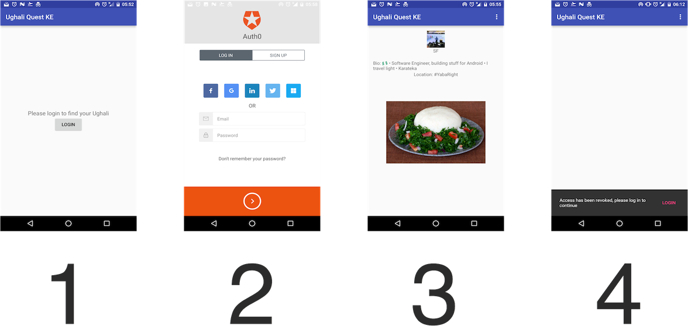

# KE Food Quest
This is a sample app to demonstrate use of auth0 for identity management in an Android app.
This is codelab from a workshop at [DevCraft 2016](http://dev-craft.co.ke) by me and
[Unicodeveloper](https://github.com/unicodeveloper) .

A user signs into the app to unlock a tasty plate of Kenyan delicacy. Most likely the
[Ughali](https://en.wikipedia.org/wiki/Ugali)

# Requirements
  * Android Studio
  * minSdkVersion 15
  * Android emulator or device

# Screenshots

  1.  Landing screen for the app, where we prompt the user to login
  2.  Login screen presented by [Auth0 Lock](https://github.com/auth0/Lock.Android)
  3.  The Ughali screen! After the user has logged in. We show some user details, and grant them access
  to the awesome delicacy.
  4.  Error message shown when access has been revoked. Demonstrating the Session management with auth0.

# Code
The repository contains a demo for the use of auth0 for identity management in your Android app.
Follow through the commits for the step by step procedures.

# Setup
  * Sign up at [https://auth0.com/](https://auth0.com/) and create a new client
  * On the dashboard, add `https://<your-auth0-domain>/android/<your-package-name>/callback`
  to the **Allowed Callback URLs** field. If you have multiple callback urls, you can seperate them
  using a comma (',')
  * In your Android app-level `build.gradle` file,
  [add auth0 dependency](https://github.com/segunfamisa/auth0-demo-android/commit/bd2d1e4924bacc551652a46080baefab4702c6e6)
  * [Add auth0 credentials](https://github.com/segunfamisa/auth0-demo-android/commit/6bace4a1eac29fcde9c6e2105261b1b9c538f271)
  * [Configure the AndroidManifest.xml file](https://github.com/segunfamisa/auth0-demo-android/commit/b01a173b57ca8bc0be88087e709bc460252d8023)
  * [Implement auth0 login with Lock](https://github.com/segunfamisa/auth0-demo-android/commit/c7be54115b61ef9a5743a446d8f946f00b9f57ba)
  * [Validate `IdToken`](https://github.com/segunfamisa/auth0-demo-android/commit/3c6bb0473cc4e5ef5e2ec00ba0425f94db512f23) to get the user details
  * [Handle expired tokens](https://github.com/segunfamisa/auth0-demo-android/commit/85ade84bcdff351db68518a33ea531050b8e53b6)

# References and resources
  * https://auth0.com/docs/quickstart/native/android
  * https://github.com/auth0-samples/auth0-android-sample

# License
MIT License
